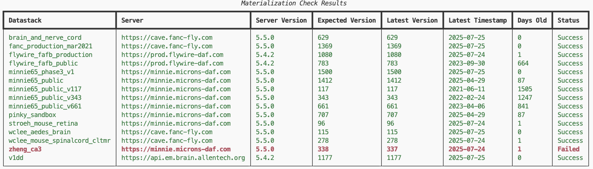

# Check Materialization Script

This repo contains a script to do a quick check of the success of Materialization across a variety of datastacks and servers and get a summary of the results.
The results summary declares failure if the last attempted materialization is not the last successful materialization present, and also offers information about materialization server version and age of the last successful materialization.



## Usage

The script is intended to be run from the command line with [`uv` ](https://astral.sh/uv). With `uv` installed, you can run the script with:

```bash
uv run --script check_materialization.py
```

Alternatively, you can run it from any environment that has `tqdm`, `caveclient`, and `rich` installed.

## License

This project is licensed under the MIT License. See the [LICENSE](LICENSE) file for details.